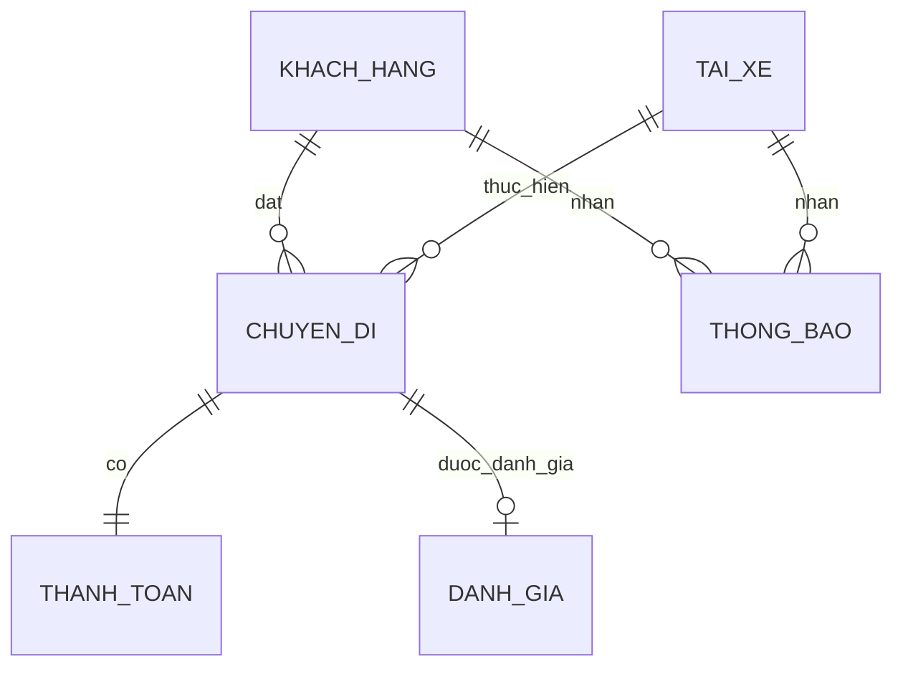

Dưới đây là tài liệu SRS được trình bày đầy đủ theo đúng cấu trúc 15 bước của bạn, giữ nguyên sự chi tiết nhưng được định dạng lại bằng bảng để gọn gàng, trực quan và không bị rườm rà.

# TÀI LIỆU ĐẶC TẢ YÊU CẦU HỆ THỐNG (SRS) - CAB SYSTEM

## Bước 1: Đọc và phân tích sơ khởi yêu cầu của khách hàng

* **Ngữ cảnh:** Công ty ABC cung cấp dịch vụ đặt xe trực tuyến qua tổng đài hoặc ứng dụng cơ bản.

* **Vấn đề hiện tại:** Phân công tài xế thủ công, khách hàng khó theo dõi chuyến đi, thanh toán chưa quản lý tập trung và hệ thống khó mở rộng.

* **Mục tiêu:** Xây dựng CAB System mới trong 7 tuần để tự động hóa điều phối, quản lý tập trung và dễ dàng mở rộng trong tương lai.

## Bước 2: Ma trận Stakeholder

| STT | Stakeholder | Vai trò & Tầm ảnh hưởng |
| --- | --- | --- |
| 1 | **Ban giám đốc** | Phê duyệt dự án, theo dõi doanh thu và hiệu quả.

 |
| 2 | **Khách hàng** | Đặt xe, theo dõi chuyến, thanh toán, đánh giá.

 |
| 3 | **Tài xế** | Nhận chuyến, cập nhật trạng thái, chia sẻ vị trí.

 |
| 4 | **Vận hành (Admin)** | Quản lý người dùng, xử lý lỗi, tra cứu lịch sử.

 |
| 5 | **Bên thứ 3** | Cung cấp cổng thanh toán và kênh thông báo.

 |

## Bước 3: Mục đích của nhiệm vụ (Business Goals - BG)

| Mã | Mục đích nhiệm vụ | Chi tiết |
| --- | --- | --- |
| **BG01** | Tự động hóa đặt xe | Xử lý yêu cầu đặt xe trực tuyến tự động.

 |
| **BG02** | Tự động điều phối | Tìm tài xế phù hợp dựa trên vị trí và trạng thái.

 |
| **BG04** | Quản lý thanh toán | Tính cước chính xác và tích hợp thanh toán điện tử.

 |
| **BG08** | Bảo mật & Phân quyền | Xác thực người dùng, bảo vệ dữ liệu, lưu vết thao tác.

 |
| **BG09** | Ổn định & Mở rộng | Hệ thống chịu tải tốt, các thành phần mở rộng độc lập.

 |

## Bước 4: Xác định phạm vi yêu cầu (In/Out of Scope)

* **Trong phạm vi (In-scope):** Quản lý khách hàng/tài xế, quản lý đặt xe, tự động phân công, theo dõi chuyến đi, tính cước thanh toán, thông báo, đánh giá, phân quyền quản trị và báo cáo.

* **Ngoài phạm vi (Out-of-scope):** Tự xây dựng cổng thanh toán/GPS/SMS, quản lý bảo dưỡng xe, tính lương tài xế, kế toán thuế chuyên sâu.

## Bước 5: Xác định Business Requirement (BR)

| Mã | Tên BR | Diễn giải |
| --- | --- | --- |
| **BR01** | Đặt chuyến | Khách nhập điểm đón/đến, loại xe và xác nhận.

 |
| **BR02** | Phân công tài xế | Tự động tìm tài xế gần nhất, tự động đổi tài xế nếu bị từ chối.

 |
| **BR03** | Thực hiện chuyến | Tài xế cập nhật trạng thái và vị trí liên tục.

 |
| **BR04** | Thanh toán | Tính tiền, hỗ trợ tiền mặt và thanh toán qua bên thứ 3.

 |

## Bước 6: Xác định Business Process (BP)

| Mã BP | Tên quy trình | Diễn giải |
| --- | --- | --- |
| **BP01** | Khách đặt chuyến | Nhập thông tin -> Hệ thống xác nhận -> Tìm tài xế.

 |
| **BP02** | Phân công tài xế | Quét tài xế sẵn sàng -> Gửi yêu cầu -> Xử lý từ chối.

 |
| **BP03** | Thực hiện chuyến | Nhận chuyến -> Đã đến -> Đã đón -> Đang di chuyển -> Hoàn thành.

 |
| **BP05** | Thanh toán | Chọn phương thức -> Gửi yêu cầu -> Nhận kết quả -> Cập nhật.

 |

## Bước 7: Phân rã yêu cầu chức năng (FR)

| BR | Mã FR | Yêu cầu chức năng chi tiết |
| --- | --- | --- |
| **BR01** | FR01-04 | Nhập điểm đón, Nhập điểm đến, Chọn loại xe, Xác nhận đặt.

 |
| **BR02** | FR05-08 | Lọc tài xế sẵn sàng, Tìm tài xế gần, Gửi yêu cầu, Tìm tài xế thay thế.

 |
| **BR03** | FR09-11 | Cập nhật trạng thái chuyến, Cập nhật vị trí tài xế, Hoàn thành chuyến.

 |
| **BR04** | FR12-14 | Tính cước, Chọn phương thức thanh toán, Xác nhận kết quả thanh toán.

 |

## Bước 8: Business Rules (Luật & Ngoại lệ)

| Nghiệp vụ | Luật quy định | Xử lý ngoại lệ |
| --- | --- | --- |
| **Tìm tài xế** | Chỉ gửi yêu cầu cho tài xế đang "Sẵn sàng".

 | Nếu tài xế không phản hồi/từ chối, hệ thống tự động tìm người khác.

 |
| **Thanh toán** | Dựa trên loại xe và độ dài chuyến đi.

 | Giao dịch thất bại phải cho phép thanh toán lại.

 |
| **Quản trị** | Yêu cầu quyền hạn (RBAC) cho từng chức năng.

 | Từ chối truy cập và lưu vết (audit log) nếu sai quyền.

 |

## Bước 9: Xây dựng Modeling Data (ERD)

*Thực thể chính:* KHACH_HANG, TAI_XE, PHUONG_TIEN, LOAI_XE, CHUYEN_DI, THANH_TOAN, DANH_GIA, THONG_BAO.

## Bước 10: Xác định các chức năng không yêu cầu

* Không yêu cầu hệ thống định vị GPS tự thiết kế (dùng API ngoài).

* Không yêu cầu cổng thanh toán nội bộ (dùng API ngoài, không lưu thông tin thẻ).

* Không phát triển tính năng đặt nhiều xe cùng lúc trong giai đoạn MVP.

## Bước 11: Xác định và vẽ Use Case Diagram

| Mã | Tên Use Case | Tác nhân |
| --- | --- | --- |
| **UC02** | Đặt chuyến | Khách hàng.

 |
| **UC03** | Tìm và phân công tài xế | Hệ thống.

 |
| **UC04** | Theo dõi chuyến đi | Khách hàng, Tài xế, Admin.

 |
| **UC10** | Quản lý vận hành | Admin.

 |

## Bước 12: Đặc tả Use Case

* **Tên UC:** UC02 - Đặt chuyến.

* **Luồng chính:** 1. Chọn đặt chuyến -> 2. Nhập điểm đón/đến -> 3. Chọn loại xe -> 4. Xác nhận -> 5. Hệ thống tạo cuốc và gọi UC03.

* **Ngoại lệ:** Thiếu thông tin bắt buộc -> Yêu cầu nhập lại. Không tìm thấy tài xế -> Thông báo.

## Bước 13: Tiêu chí chấp nhận (Acceptance Criteria - AC)

| Mã | Use Case | Tiêu chí nghiệm thu (AC) |
| --- | --- | --- |
| **AC02** | Đặt chuyến | Nhập đủ điểm đón, điểm đến, loại xe và xác nhận -> Tạo chuyến thành công.

 |
| **AC03** | Phân công | Quá thời gian timeout mà tài xế không nhận -> Phải đổi tài xế khác.

 |
| **AC06** | Thanh toán | Tính đúng số tiền, ghi nhận chính xác trạng thái thành công/thất bại từ cổng thanh toán.

 |

## Bước 14: Truy xuất nguồn gốc yêu cầu (RTM)

| Business Goal | Business Requirement | Functional Requirement | Use Case | Acceptance Criteria |
| --- | --- | --- | --- | --- |
| **BG01** (Đặt xe) | **BR01** (Đặt chuyến) | FR01, FR02, FR03, FR04 | UC02 | AC02 (Tạo chuyến thành công).

 |
| **BG02** (Tìm tài xế) | **BR02** (Phân công) | FR05, FR06, FR07, FR08 | UC03 | AC03 (Tự động đổi tài xế).

 |
| **BG04** (Thanh toán) | **BR04** (Tính cước) | FR12, FR13, FR14 | UC06 | AC06 (Xác nhận kết quả).

 |

## Bước 15: Yêu cầu phi chức năng (NFR) & Vấn đề chờ xác nhận (TBD)

**Yêu cầu phi chức năng (NFR):**

* **Hệ thống:** Phải mở rộng độc lập khi tải cao (Lỗi module thanh toán không làm chết module đặt xe).

* **Bảo mật:** Không lưu thông tin thẻ thanh toán; mọi thao tác vận hành nhạy cảm phải lưu vết audit log.

**Vấn đề cần làm rõ với khách hàng (TBD):**

* Chi tiết công thức tính cước và tiêu chí ưu tiên khi ghép tài xế.

* Thời gian giới hạn (timeout) để tài xế phản hồi cuốc xe là bao lâu?

* Cách xử lý luồng đi khi thiết bị mất kết nối mạng đột ngột.
