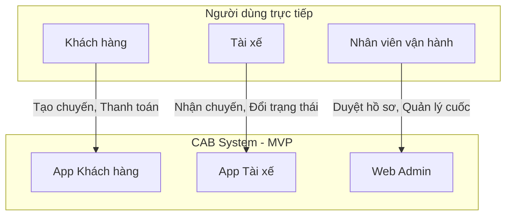

# TÀI LIỆU ĐẶC TẢ YÊU CẦU HỆ THỐNG (SRS) - CAB SYSTEM (BẢN MVP)

## Bước 1: Đọc và phân tích sơ khởi yêu cầu của khách hàng
**1. Hiểu ngữ cảnh nghiệp vụ**
Công ty ABC kinh doanh dịch vụ đặt xe trực tuyến. Khách hàng đặt xe thông qua tổng đài hoặc ứng dụng, sau đó hệ thống tìm tài xế, thực hiện chuyến đi, tính cước, thanh toán và đánh giá. Công ty muốn xây dựng CAB System trong 7 tuần để tự động hóa quy trình cho 3 nhóm người dùng chính: Khách hàng, Tài xế, và Nhân viên vận hành.

**2. Khách hàng đang gặp vấn đề gì?**
* Việc tìm kiếm và phân công tài xế còn thủ công.
* Khách hàng khó theo dõi trạng thái chuyến đi.
* Khó xử lý khi tài xế từ chối hoặc không phản hồi.
* Nhân viên vận hành khó quản lý, thống kê số liệu rời rạc.

**3. Giải pháp hệ thống mới (MVP)**
Xây dựng nền tảng CAB cốt lõi giúp số hóa quy trình: Khách hàng tự đặt cuốc, hệ thống đẩy yêu cầu lên bảng tin chung cho tài xế nhận (nhận cuốc chủ động), theo dõi luồng đi qua các trạng thái tĩnh và thanh toán bằng tiền mặt để đảm bảo khả năng hoàn thiện trong 7 tuần.

---

## Bước 2: Ma trận Stakeholder (Vai trò & Tầm ảnh hưởng)

| STT | Stakeholder | Vai trò |
| :--- | :--- | :--- |
| 1 | **Khách hàng** | Đặt xe, theo dõi trạng thái, thanh toán tiền mặt và đánh giá. |
| 2 | **Tài xế** | Xem danh sách cuốc, nhận chuyến, cập nhật trạng thái. |
| 3 | **Nhân viên vận hành** | Quản lý thông tin tài khoản, chuyến đi, xử lý sự cố. |
| 4 | **Ban giám đốc** | Theo dõi doanh thu, báo cáo tổng quan. |
| 5 | **Đội phát triển** | Thiết kế, xây dựng, kiểm thử hệ thống. |

Bước 3: Mục đích của nhiệm vụ (Business Goals - BG)
Mã	Mục đích nhiệm vụ	Nội dung
BG01	Tự động hóa đặt xe	Khách hàng tự đặt xe trên hệ thống.
BG02	Điều phối cuốc xe nhanh	Tài xế chủ động nhận cuốc xe từ danh sách yêu cầu chung.
BG03	Minh bạch hành trình	Khách hàng và Vận hành theo dõi được trạng thái chuyến đi.
BG04	Chuẩn hóa tính cước	Hệ thống tự tính toán tổng tiền chính xác để khách trả tiền mặt.
BG05	Nâng cao hiệu quả vận hành	Quản lý dữ liệu tập trung trên một giao diện duy nhất.
Bước 4: Xác định phạm vi yêu cầu (In/Out of Scope)
1. Phạm vi trong hệ thống (In-scope)

Đăng ký/Đăng nhập, Quản lý hồ sơ Khách hàng & Tài xế.

Đặt chuyến xe (nhập điểm đón/đến, chọn loại xe).

Điều phối xe (Hàng đợi cuốc xe - Broadcasting).

Cập nhật trạng thái chuyến đi (Chờ -> Đã đón -> Đang chạy -> Hoàn thành).

Tính toán cước phí cơ bản.

Đánh giá cuốc xe (1-5 sao).

Quản trị viên: Phê duyệt tài xế, xem danh sách chuyến, báo cáo doanh thu cơ bản.

2. Ngoài phạm vi dự án (Out-of-scope)

❌ Không vẽ bản đồ GPS theo thời gian thực (real-time tracking).

❌ Không tích hợp cổng thanh toán điện tử (chỉ tích hợp NCC ngoài hoặc bỏ qua trong MVP).

❌ Không có hệ thống điều phối thuật toán quét bán kính tự động.

❌ Không quản lý lương, thưởng, chấm công tài xế.

❌ Không tự xây dựng hệ thống SMS/Email riêng (chỉ dùng API ngoài).

Bước 5: Xác định Business Requirement (BR)
Mã	Tên Business Requirement	Diễn giải
BR01	Đặt chuyến	Khách hàng nhập điểm đón, điểm đến, chọn loại xe và xác nhận.
BR02	Nhận chuyến xe	Yêu cầu hiển thị cho các tài xế sẵn sàng, ai bấm nhận trước sẽ được phân công.
BR03	Thực hiện chuyến đi	Tài xế bấm cập nhật từng trạng thái tĩnh trong suốt hành trình.
BR04	Tính cước và thanh toán	Hệ thống tính tổng tiền, kết thúc bằng tiền mặt.
BR05	Đánh giá tài xế	Khách hàng chấm sao sau khi chuyến hoàn tất.
BR06	Quản lý hệ thống	Nhân viên vận hành theo dõi chuyến, quản lý tài khoản và báo cáo.
Bước 6: Xác định Business Process (BP)
Mã BP	Tên quy trình	Diễn giải
BP01	Khách đặt chuyến	Nhập thông tin → Hệ thống xác nhận cước → Tạo cuốc.
BP02	Tài xế nhận chuyến	Bật sẵn sàng → Xem danh sách cuốc chờ → Chọn "Nhận chuyến" → Hệ thống gán tài xế.
BP03	Thực hiện & Thanh toán	Đổi trạng thái "Đã đón" → "Hoàn thành" → Thu tiền mặt → Kết thúc.
BP04	Quản lý vận hành	Đăng nhập Admin → Xem danh sách → Khóa/Mở tài khoản, Xem báo cáo.
Bước 7: Phân rã yêu cầu chức năng (FR)
BR	Mã FR	Yêu cầu chức năng chi tiết
BR01	FR01-FR03	Nhập địa chỉ đón/đến, chọn loại xe, tạo chuyến.
BR02	FR04-FR05	Hiển thị danh sách cuốc xe chờ cho tài xế, chức năng bấm "Nhận chuyến".
BR03	FR06-FR08	Cập nhật trạng thái: Đã đến, Đang di chuyển, Hoàn thành.
BR04	FR09-FR10	Tự động tính tiền dựa trên khoảng cách/loại xe ước tính.
BR05	FR11	Form đánh giá sao và nhập ghi chú.
BR06	FR12-FR14	Phê duyệt/Khóa tài khoản, xem danh sách chuyến, xem tổng doanh thu.
Bước 8: Business Rules (Luật quy định) & Ngoại lệ
Nghiệp vụ	Luật và quy định	Ngoại lệ
Đặt cuốc	Khách chỉ được đặt 1 chuyến tại 1 thời điểm.	Đang có cuốc chưa hoàn thành → Chặn không cho đặt tiếp.
Nhận chuyến	Cuốc xe được gán cho người bấm "Nhận" đầu tiên.	Tài xế thứ 2 bấm vào → Báo lỗi "Cuốc đã có người nhận".
Thực hiện	Bắt buộc cập nhật trạng thái theo thứ tự.	Tài xế quên cập nhật → Phải bấm bù các bước trước khi hoàn thành.
Vận hành	Chỉ Admin mới xem được báo cáo doanh thu.	Nhân viên cấp dưới → Không hiển thị menu Báo cáo.
Bước 9: Mô hình dữ liệu (ERD)
Đoạn mã
erDiagram
    KHACH_HANG ||--o{ CHUYEN_DI : dat
    TAI_XE ||--o{ CHUYEN_DI : thuc_hien
    LOAI_XE ||--o{ CHUYEN_DI : thuoc
    CHUYEN_DI ||--o| DANH_GIA : co

    KHACH_HANG {
        int MaKH PK
        string HoTen
        string SoDienThoai
    }

    TAI_XE {
        int MaTX PK
        string HoTen
        string SoDienThoai
        string BienSoXe
        string TrangThai
    }

    CHUYEN_DI {
        int MaChuyen PK
        int MaKH FK
        int MaTX FK
        int MaLoaiXe FK
        string DiemDon
        string DiemDen
        string TrangThai
        decimal TongTien
    }
Bước 10: Chức năng không yêu cầu (MVP Boundaries)
Trong giai đoạn đầu, hệ thống bỏ qua việc tối ưu thời gian phản hồi nâng cao (realtime tracking), tự động quét bán kính, tích hợp SMS thật, hay dự báo giá động (AI) để đảm bảo tiến độ triển khai.

Bước 11 & 12: Sơ đồ & Đặc tả Use Case
Đoạn mã
flowchart LR
    KH([Khách hàng])
    TX([Tài xế])
    NV([Admin])
    
    UC01((Đăng nhập/Đăng ký))
    UC02((Đặt chuyến))
    UC03((Nhận chuyến))
    UC04((Cập nhật trạng thái))
    UC05((Đánh giá))
    UC06((Quản lý hệ thống))

    KH --- UC01
    KH --- UC02
    KH --- UC05
    
    TX --- UC01
    TX --- UC03
    TX --- UC04
    
    NV --- UC01
    NV --- UC06
Bước 13: Tiêu chí chấp nhận (AC)
Mã	Use Case	Tiêu chí nghiệm thu (AC)
AC01	Đăng ký/Đăng nhập	Nhập đúng thông tin đăng nhập thành công; sai báo lỗi.
AC02	Đặt chuyến	Khách điền đủ thông tin, màn hình hiển thị số tiền dự kiến và chuyển sang chờ.
AC03	Nhận chuyến	Tài xế bấm nhận thành công, trạng thái chuyến đổi thành "Đã có tài xế", biến mất khỏi bảng chung.
AC04	Cập nhật	Tài xế đổi sang trạng thái "Hoàn thành", hệ thống hiện tổng tiền thu tiền mặt.
AC06	Quản lý	Admin xem được chuyến đang diễn ra, xem được doanh thu.
Bước 14: Ma trận truy xuất nguồn gốc (RTM)
Business Requirement (BR)	Functional Requirement (FR)	Use Case (UC)	Acceptance Criteria (AC)
BR01 (Đặt xe)	FR01, FR02, FR03	UC02	AC02 (Tạo chuyến thành công, tính ra tiền)
BR02 (Nhận chuyến)	FR04, FR05	UC03	AC03 (Gán ID tài xế vào bảng CHUYEN_DI)
BR03 (Thực hiện)	FR06, FR07, FR08	UC04	AC04 (Trạng thái chuyến cập nhật đúng)
BR06 (Quản lý)	FR12, FR13, FR14	UC06	AC06 (Hiển thị đúng số liệu báo cáo)
