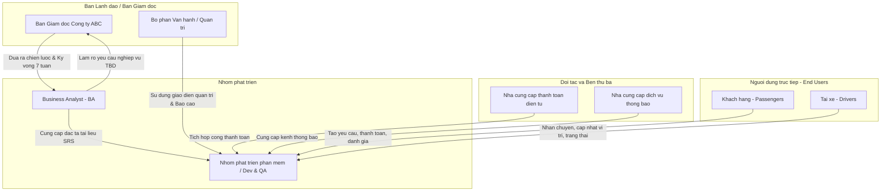

1. Tài liệu Đặc tả Yêu cầu (SRS) được chuẩn hóaMarkdown# TÀI LIỆU ĐẶC TẢ YÊU CẦU HỆ THỐNG (SRS) - CAB SYSTEM

## Bước 1: Đọc và phân tích sơ khởi yêu cầu của khách hàng
**1. Hiểu ngữ cảnh nghiệp vụ**
Công ty ABC kinh doanh dịch vụ đặt xe trực tuyến. Khách hàng đặt xe thông qua tổng đài hoặc ứng dụng, sau đó hệ thống tìm tài xế, thực hiện chuyến đi, tính cước, thanh toán và đánh giá. Công ty muốn xây dựng CAB System trong 7 tuần để tự động hóa quy trình và hỗ trợ 3 nhóm người dùng chính: Khách hàng, Tài xế, và Nhân viên vận hành.

**2. Khách hàng đang gặp vấn đề gì?**
* Việc tìm kiếm và phân công tài xế còn thủ công.
* Khách hàng khó theo dõi trạng thái chuyến đi và thời gian tài xế đến.
* Thông tin thanh toán chưa được quản lý tập trung.
* Khó xử lý khi tài xế từ chối hoặc không phản hồi.
* Nhân viên vận hành khó quản lý, khó thống kê báo cáo (doanh thu, số chuyến).
* Hệ thống hiện tại khó mở rộng, cần cải thiện bảo mật và lưu vết thao tác.

**3. Vấn đề nghiệp vụ tổng quát**
Công ty ABC đang gặp khó khăn trong việc quản lý và vận hành dịch vụ đặt xe do quy trình phân công thủ công, khách hàng khó theo dõi chuyến đi, thanh toán chưa tập trung và hệ thống khó mở rộng. Cần xây dựng CAB System để tự động hóa quy trình đặt xe, nâng cao hiệu quả vận hành và tạo nền tảng có khả năng mở rộng.

---

## Bước 2: Ma trận Stakeholder (Vai trò & Tầm ảnh hưởng)

| STT | Stakeholder | Vai trò |
| :--- | :--- | :--- |
| 1 | **Ban giám đốc** | Đưa ra định hướng, phê duyệt dự án, theo dõi doanh thu và hiệu quả hoạt động |
| 2 | **Khách hàng** | Đặt xe, theo dõi chuyến đi, thanh toán và đánh giá tài xế |
| 3 | **Tài xế** | Nhận chuyến, thực hiện chuyến và cập nhật trạng thái, vị trí |
| 4 | **Nhân viên vận hành** | Quản lý khách hàng, tài xế, phương tiện, chuyến đi và xử lý sự cố |
| 5 | **Nhân viên quản trị** | Quản lý tài khoản, phân quyền, bảo mật và cấu hình hệ thống |
| 6 | **NCC thanh toán** | Cung cấp dịch vụ và xử lý thanh toán điện tử |
| 7 | **NCC thông báo** | Cung cấp các kênh gửi thông báo cho khách hàng và tài xế | 
| 8 | **Đội phát triển** | Thiết kế, xây dựng, kiểm thử và triển khai hệ thống |

Bước 3: Mục đích của nhiệm vụ (Business Goals - BG)MãMục đích nhiệm vụNội dungBG01Tự động hóa quy trình đặt xeKhách hàng đặt xe trực tuyến và hệ thống tự động xử lý.  BG02Tự động tìm & phân côngTìm tài xế phù hợp dựa trên vị trí, trạng thái sẵn sàng.  BG03Nâng cao theo dõi chuyến điTheo dõi trạng thái chuyến và vị trí tài xế.  BG04Quản lý tính cước & thanh toánTính chính xác số tiền, hỗ trợ thanh toán tiền mặt/điện tử.  BG05Quản lý thông báoCung cấp thông báo kịp thời cho khách hàng và tài xế.  BG06Nâng cao hiệu quả vận hànhHỗ trợ quản lý khách hàng, tài xế, phương tiện, xử lý sự cố.  BG07Báo cáo và thống kêTheo dõi số chuyến, doanh thu, tỷ lệ hoàn thành/hủy.  BG08An toàn và bảo mật dữ liệuXác thực, phân quyền, bảo vệ dữ liệu cá nhân/vị trí.  BG09Ổn định và mở rộngHoạt động ổn định khi tải tăng, cho phép mở rộng độc lập.  BG10Nền tảng phát triển lâu dàiCho phép bổ sung dịch vụ, phương thức thanh toán trong tương lai.  Bước 4: Xác định phạm vi yêu cầu (In/Out of Scope)1. Phạm vi trong hệ thống (In-scope)MDP01-03: Quản lý khách hàng, Quản lý tài xế, Quản lý phương tiện.  MDP04-06: Quản lý đặt xe, Tìm kiếm & phân công tài xế, Quản lý chuyến đi.  MDP07-09: Tính cước & thanh toán, Quản lý thông báo, Đánh giá chuyến đi.  MDP10-12: Quản lý vận hành, Quản trị & phân quyền, Báo cáo & thống kê.  2. Ngoài phạm vi dự án (Out-of-scope)Không tự xây dựng cổng thanh toán điện tử, hệ thống SMS/Email, bản đồ/GPS (chỉ tích hợp).  Không quản lý bảo dưỡng xe, tính lương/thưởng tài xế, kế toán thuế.  Không làm dịch vụ giao hàng hoặc thiết bị phần cứng theo dõi riêng.  Bước 5: Xác định Business Requirement (BR)MãTên Business RequirementDiễn giảiBR01Đặt chuyếnKhách hàng nhập điểm đón, điểm đến, chọn loại xe và xác nhận.  BR02Tìm và phân công tài xếTìm tài xế phù hợp, gửi yêu cầu và xử lý khi tài xế từ chối.  BR03Thực hiện chuyến điTài xế cập nhật trạng thái và vị trí từ lúc nhận đến khi hoàn thành.  BR04Tính cước và thanh toánTính cước, hỗ trợ thanh toán bằng tiền mặt hoặc điện tử.  BR05Quản lý thông báoGửi thông báo sự kiện chuyến đi và thanh toán.  BR06Đánh giá tài xếKhách hàng đánh giá tài xế sau khi hoàn thành chuyến đi.  BR07Quản lý khách hàng và tài xếQuản lý thông tin, tài khoản, trạng thái người dùng.  BR08Quản lý vận hành và báo cáoTheo dõi chuyến, xử lý sự cố và xem các báo cáo hoạt động.  Bước 6: Xác định Business Process (BP)BP01-BP03: Khách hàng đặt chuyến -> Tìm và phân công tài xế -> Thực hiện chuyến đi.  BP04-BP07: Tính cước -> Thanh toán -> Thông báo chuyến đi -> Đánh giá tài xế.  BP08-BP12: Quản lý khách hàng/tài xế, Vận hành xử lý sự cố, Phân quyền và Báo cáo thống kê.  Bước 7: Phân rã yêu cầu chức năng (FR)BRMã FRYêu cầu chức năng chi tiếtBR01FR01-FR04Nhập điểm đón, điểm đến, chọn loại xe, xác nhận đặt chuyến.  BR02FR05-FR08Xác định tài xế sẵn sàng, tìm tài xế gần, gửi yêu cầu, tìm tài xế khác khi bị từ chối.  BR03FR09-FR11Cập nhật trạng thái chuyến, cập nhật vị trí tài xế, hoàn thành chuyến[cite: 3].BR04FR12-FR14Tính cước chuyến đi, chọn phương thức thanh toán, xác nhận kết quả[cite: 3].BR05-06FR15-FR17Thông báo trạng thái chuyến/thanh toán, đánh giá tài xế[cite: 3].BR07-08FR18-FR23Quản lý thông tin/trạng thái khách hàng & tài xế, xử lý lỗi, xem báo cáo[cite: 3].Bước 8: Business Rules (Luật quy định) & Ngoại lệNghiệp vụLuật và quy địnhNgoại lệĐặt & Tìm tài xếChỉ tài xế đang "sẵn sàng" mới được đề xuất[cite: 3].Từ chối quá hạn → tự động tìm tài xế khác[cite: 3].Thực hiện chuyếnTài xế cập nhật tuần tự: Đã đến → Đã đón → Đang di chuyển → Hoàn thành[cite: 3].Tài xế không cập nhật → nhân viên vận hành xử lý[cite: 3].Thanh toánDựa trên loại dịch vụ và thông tin chuyến đi[cite: 3].Thanh toán lỗi → thông báo, cho phép thanh toán lại[cite: 3].Bảo mật & Vận hànhYêu cầu đăng nhập, đúng quyền hạn quản trị[cite: 3].Đăng nhập sai / Thiếu quyền → từ chối truy cập[cite: 3].Bước 9: Mô hình dữ liệu (ERD)Thực thể: KHACH_HANG, TAI_XE, PHUONG_TIEN, LOAI_XE, CHUYEN_DI, THANH_TOAN, DANH_GIA, THONG_BAO[cite: 3].Đoạn mãerDiagram
    KHACH_HANG ||--o{ CHUYEN_DI : dat
    TAI_XE ||--o{ CHUYEN_DI : thuc_hien
    TAI_XE ||--|| PHUONG_TIEN : su_dung
    LOAI_XE ||--o{ PHUONG_TIEN : thuoc
    CHUYEN_DI ||--|| THANH_TOAN : co
    CHUYEN_DI ||--o| DANH_GIA : duoc_danh_gia
    KHACH_HANG ||--o{ THONG_BAO : nhan
    TAI_XE ||--o{ THONG_BAO : nhan
Bước 10: Chức năng không yêu cầu (MVP)Chưa cần làm trong MVP: Quản lý sửa chữa xe, tính lương, kế toán thuế, cổng thanh toán tự làm, đặt nhiều chuyến cùng lúc, đặt xe định kỳ, khuyến mãi, chat trực tiếp, dự báo giá động AI[cite: 3].Bước 11 & 12: Danh sách và Sơ đồ Use CaseDanh sách: UC01 (Đăng nhập/Ký), UC02 (Đặt chuyến), UC03 (Tìm tài xế), UC04 (Theo dõi chuyến), UC05 (Thực hiện chuyến), UC06 (Thanh toán), UC07 (Đánh giá), UC08-UC10 (Quản lý User/Vận hành), UC11 (Báo cáo)[cite: 3].Đoạn mãflowchart LR
    KH([Khách hàng])
    TX([Tài xế])
    NV([Nhân viên])
    
    UC02((Đặt chuyến))
    UC03((Tìm tài xế))
    UC04((Theo dõi chuyến))
    UC05((Thực hiện chuyến))
    UC06((Thanh toán))
    UC10((Quản lý vận hành))

    KH --- UC02
    KH --- UC04
    KH --- UC06
    TX --- UC04
    TX --- UC05
    NV --- UC10

    UC02 -.->|include| UC03
    UC05 -.->|include| UC04
Bước 13: Tiêu chí chấp nhận (AC)MãUse CaseTiêu chí chấp nhậnAC02Đặt chuyếnKhách nhập đủ điểm đón, điểm đến, loại xe và xác nhận → tạo chuyến thành công[cite: 3].AC03Phân côngHệ thống chỉ tìm tài xế sẵn sàng; nếu từ chối/không phản hồi → tự tìm tài xế khác[cite: 3].AC05Thực hiệnTài xế cập nhật được các trạng thái: đã đến, đã đón khách, đang di chuyển, hoàn thành[cite: 3].AC06Thanh toánTính đúng số tiền, cập nhật kết quả thanh toán thành công/thất bại[cite: 3].Bước 14: Ma trận truy xuất nguồn gốc (RTM)BGBRFRUCACTCBG01BR01 (Đặt)FR01-FR04UC02AC02 (Đủ thông tin → tạo)TC01-TC04BG02BR02 (Phân công)FR05-FR08UC03AC03 (Tự tìm tài xế khác)TC05-TC08BG03BR03 (Thực hiện)FR09-FR11UC05AC05 (Cập nhật đúng trạng thái)TC09-TC11BG04BR04 (Thanh toán)FR12-FR14UC06AC06 (Hiển thị đúng tiền, kết quả)TC12-TC14
