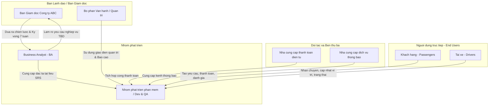

# Tài liệu Đặc tả Yêu cầu Hệ thống (SRS) - CAB System

## Bước 1: Đọc và phân tích sơ khởi yêu cầu của khách hàng

### 1. Hiểu ngữ cảnh nghiệp vụ
Công ty ABC kinh doanh dịch vụ đặt xe trực tuyến. Khách hàng đặt xe thông qua tổng đài hoặc ứng dụng, sau đó hệ thống tìm tài xế, thực hiện chuyến đi, tính cước, thanh toán và đánh giá.

Công ty muốn xây dựng CAB System trong 7 tuần để tự động hóa quy trình và hỗ trợ 3 nhóm người dùng chính:
*   Khách hàng: đặt và theo dõi chuyến xe, thanh toán, đánh giá.
*   Tài xế: nhận chuyến, cập nhật trạng thái và vị trí.
*   Nhân viên vận hành: quản lý khách hàng, tài xế, chuyến đi, giao dịch và báo cáo.

### 2. Khách hàng đang gặp vấn đề gì?
*   Việc tìm kiếm và phân công tài xế còn thủ công.
*   Khách hàng khó theo dõi trạng thái chuyến đi và thời gian tài xế đến.
*   Thông tin thanh toán chưa được quản lý tập trung.
*   Khi tài xế từ chối hoặc không phản hồi, việc tìm tài xế khác còn hạn chế.
*   Nhân viên vận hành khó quản lý tài xế, khách hàng, chuyến đi và giao dịch.
*   Khó xử lý các trường hợp chuyến bị lỗi hoặc phát sinh sự cố.
*   Khó thống kê doanh thu, số lượng chuyến, tỷ lệ hoàn thành/hủy và hiệu quả tài xế.
*   Hệ thống hiện tại khó mở rộng khi số lượng khách hàng và tài xế tăng.
*   Cần cải thiện bảo mật, phân quyền và lưu vết thao tác.

### 3. Tại sao cần lựa chọn hệ thống mới?
Công ty ABC cần xây dựng hệ thống mới để:
*   Tự động hóa việc tìm kiếm và phân công tài xế.
*   Giúp khách hàng đặt xe và theo dõi chuyến đi dễ dàng.
*   Quản lý tập trung chuyến đi và thanh toán[cite: 1, 2].
*   Hỗ trợ nhân viên vận hành quản lý và xử lý sự cố hiệu quả[cite: 1, 2].
*   Cung cấp báo cáo và thống kê phục vụ quản lý[cite: 1, 2].
*   Nâng cao tính bảo mật và phân quyền[cite: 1, 2].
*   Đảm bảo hệ thống ổn định, dễ mở rộng và dễ bảo trì[cite: 1, 2].
*   Cho phép bổ sung dịch vụ, phương thức thanh toán và kênh thông báo mới trong tương lai[cite: 1, 2].

### 4. Vấn đề nghiệp vụ tổng quát
> Công ty ABC đang gặp khó khăn trong việc quản lý và vận hành dịch vụ đặt xe do quy trình phân công tài xế còn thủ công, khách hàng khó theo dõi chuyến đi, thanh toán chưa được quản lý tập trung và hệ thống khó mở rộng[cite: 1, 2]. Vì vậy, công ty cần xây dựng CAB System để tự động hóa quy trình đặt xe, nâng cao hiệu quả vận hành, cải thiện trải nghiệm khách hàng và tạo nền tảng có khả năng mở rộng trong tương lai[cite: 1, 2].

---

## Bước 2: Ma trận Stakeholder (Vai trò và Tầm ảnh hưởng)

| STT | Stakeholder                     | Vai trò                                                                      |
| --- | ------------------------------- | ---------------------------------------------------------------------------- |
| 1   | **Ban giám đốc**                | Đưa ra định hướng, phê duyệt dự án, theo dõi doanh thu và hiệu quả hoạt động[cite: 1, 2] |
| 2   | **Khách hàng**                  | Đặt xe, theo dõi chuyến đi, thanh toán và đánh giá tài xế[cite: 1, 2]                    |
| 3   | **Tài xế**                      | Nhận chuyến, thực hiện chuyến và cập nhật trạng thái, vị trí[cite: 1, 2]                 |
| 4   | **Nhân viên vận hành**          | Quản lý khách hàng, tài xế, phương tiện, chuyến đi và xử lý sự cố[cite: 1, 2]            |
| 5   | **Nhân viên quản trị hệ thống** | Quản lý tài khoản, phân quyền, bảo mật và cấu hình hệ thống[cite: 1, 2]                  |
| 6   | **Nhà cung cấp thanh toán**     | Cung cấp dịch vụ và xử lý thanh toán điện tử[cite: 1, 2]                                 |
| 7   | **Nhà cung cấp thông báo**      | Cung cấp các kênh gửi thông báo cho khách hàng và tài xế[cite: 1, 2]                     | 
| 8   | **Đội phát triển hệ thống**     | Thiết kế, xây dựng, kiểm thử và triển khai hệ thống                          |


## Bước 3: Mục đích của dự án (Business Goals - BG)

| Mã       | Mục đích nhiệm vụ                            | Nội dung                                                                                                          |
| -------- | -------------------------------------------- | ----------------------------------------------------------------------------------------------------------------- |
| **BG01** | **Tự động hóa quy trình đặt xe**             | Cho phép khách hàng đặt xe trực tuyến và hệ thống tự động xử lý yêu cầu đặt xe[cite: 2].                                   |
| **BG02** | **Tự động tìm và phân công tài xế**          | Tìm tài xế phù hợp dựa trên vị trí, trạng thái sẵn sàng và các tiêu chí vận hành[cite: 2].                                 |
| **BG03** | **Nâng cao khả năng theo dõi chuyến đi**     | Cho phép khách hàng và nhân viên vận hành theo dõi trạng thái chuyến và vị trí tài xế[cite: 2].                            |
| **BG04** | **Quản lý tính cước và thanh toán**          | Tính chính xác số tiền phải trả và hỗ trợ thanh toán tiền mặt hoặc điện tử[cite: 2].                                       |
| **BG05** | **Quản lý thông báo**                        | Cung cấp thông báo kịp thời cho khách hàng và tài xế trong quá trình đặt và thực hiện chuyến[cite: 2].                     |
| **BG06** | **Nâng cao hiệu quả vận hành**               | Hỗ trợ nhân viên quản lý khách hàng, tài xế, phương tiện, chuyến đi và xử lý sự cố[cite: 2].                               |
| **BG07** | **Cung cấp báo cáo và thống kê**             | Theo dõi số chuyến, doanh thu, tỷ lệ hoàn thành, tỷ lệ hủy và hiệu quả tài xế[cite: 2].                                    |
| **BG08** | **Đảm bảo an toàn và bảo mật dữ liệu**       | Xác thực người dùng, phân quyền quản trị, bảo vệ dữ liệu cá nhân, vị trí và giao dịch[cite: 2].                            |
| **BG09** | **Đảm bảo tính ổn định và khả năng mở rộng** | Hệ thống hoạt động ổn định khi tải tăng và cho phép mở rộng từng thành phần độc lập[cite: 2].                              |
| **BG10** | **Tạo nền tảng phát triển lâu dài**          | Cho phép bổ sung dịch vụ, phương thức thanh toán, kênh thông báo và thay đổi thành phần kỹ thuật trong tương lai[cite: 2]. |
Markdown
## Bước 4: Xác định phạm vi dự án (In/Out of Scope)

### 1. Phạm vi trong hệ thống (In Scope)
| Mã        | Module                          | Nội dung chính                                                                              |
| --------- | ------------------------------- | ------------------------------------------------------------------------------------------- |
| **MDP01** | **Quản lý khách hàng**          | Đăng ký, đăng nhập, cập nhật thông tin, xem lịch sử chuyến[cite: 2]                                  |
| **MDP02** | **Quản lý tài xế**              | Quản lý hồ sơ, trạng thái hoạt động, vị trí, và tạo mới tài khoản bởi vận hành[cite: 1, 2]              |
| **MDP03** | **Quản lý phương tiện**         | Quản lý thông tin xe, loại xe và phương tiện của tài xế[cite: 2]                                     |
| **MDP04** | **Quản lý đặt xe**              | Nhập điểm đón/điểm đến, chọn loại xe, tạo và quản lý yêu cầu đặt xe[cite: 2]                         |
| **MDP05** | **Tìm kiếm & phân công tài xế** | Tìm tài xế phù hợp, ưu tiên tài xế gần và tự động xử lý khi tài xế từ chối/không phản hồi[cite: 1, 2]   |
| **MDP06** | **Quản lý chuyến đi**           | Theo dõi và cập nhật trạng thái chuyến: đến điểm đón, đón khách, đang di chuyển, hoàn thành[cite: 2] |
| **MDP07** | **Tính cước & thanh toán**      | Tính tiền chuyến đi, hỗ trợ tiền mặt và thanh toán điện tử thông qua nhà cung cấp bên ngoài[cite: 1, 2] |
| **MDP08** | **Quản lý thông báo**           | Gửi thông báo về đặt xe, nhận chuyến, trạng thái chuyến và thanh toán[cite: 2]                       |
| **MDP09** | **Đánh giá chuyến đi**          | Khách hàng đánh giá tài xế sau khi hoàn thành chuyến[cite: 2]                                        |
| **MDP10** | **Quản lý vận hành**            | Theo dõi chuyến đang diễn ra, trạng thái tài xế và xử lý sự cố[cite: 2]                              |
| **MDP11** | **Quản trị & phân quyền**       | Quản lý tài khoản nhân viên, quyền truy cập và lưu vết thao tác (Audit log)[cite: 1, 2]                 |
| **MDP12** | **Báo cáo & thống kê**          | Báo cáo số chuyến, doanh thu, tỷ lệ hoàn thành, tỷ lệ hủy và hiệu quả tài xế[cite: 2]                |

### 2. Ngoài phạm vi dự án (Out of Scope)
*   ❌ Tự xây dựng cổng thanh toán điện tử → chỉ tích hợp nhà cung cấp bên ngoài[cite: 1, 2].
*   ❌ Tự xây dựng hệ thống SMS/Email/Push Notification → chỉ tích hợp dịch vụ thông báo bên ngoài[cite: 1, 2].
*   ❌ Phát triển bản đồ/GPS riêng → chỉ sử dụng dịch vụ bản đồ/vị trí bên ngoài[cite: 2].
*   ❌ Quản lý bảo dưỡng, sửa chữa phương tiện[cite: 2].
*   ❌ Quản lý lương, thưởng và chấm công tài xế[cite: 2].
*   ❌ Quản lý kế toán, thuế và tài chính doanh nghiệp chuyên sâu[cite: 2].
*   ❌ Xây dựng dịch vụ giao đồ ăn/giao hàng hoặc các dịch vụ khác ngoài đặt xe[cite: 2].
*   ❌ Xây dựng phần cứng GPS hoặc thiết bị theo dõi riêng[cite: 2].
Markdown
## Bước 5: Xác định Business Requirement (BR)

| Mã       | Tên Business Requirement         | Diễn giải                                                                                   |
| -------- | -------------------------------- | ------------------------------------------------------------------------------------------- |
| **BR01** | **Đặt chuyến**                   | Khách hàng nhập điểm đón, điểm đến, chọn loại xe và gửi yêu cầu đặt chuyến[cite: 2].                 |
| **BR02** | **Tìm và phân công tài xế**      | Hệ thống tìm tài xế phù hợp, gửi yêu cầu nhận chuyến và xử lý khi tài xế từ chối[cite: 2].           |
| **BR03** | **Thực hiện chuyến đi**          | Tài xế cập nhật trạng thái và vị trí từ khi nhận chuyến đến khi hoàn thành[cite: 2].                 |
| **BR04** | **Tính cước và thanh toán**      | Hệ thống tính cước và hỗ trợ thanh toán bằng tiền mặt hoặc điện tử[cite: 2].                         |
| **BR05** | **Quản lý thông báo**            | Hệ thống gửi thông báo cho khách hàng và tài xế về các sự kiện của chuyến đi và thanh toán[cite: 2]. |
| **BR06** | **Đánh giá tài xế**              | Khách hàng đánh giá tài xế sau khi hoàn thành chuyến đi[cite: 2].                                    |
| **BR07** | **Quản lý khách hàng và tài xế** | Hệ thống quản lý thông tin, tài khoản, trạng thái của khách hàng và tài xế[cite: 2].                 |
| **BR08** | **Quản lý vận hành và báo cáo**  | Nhân viên vận hành theo dõi chuyến, xử lý sự cố và xem các báo cáo hoạt động[cite: 2].               |
Markdown
## Bước 6: Xác định Business Process (BP)

| Mã BP    | Tên quy trình                       | Diễn giải                                                                                                                                                                          |
| -------- | ----------------------------------- | ---------------------------------------------------------------------------------------------------------------------------------------------------------------------------------- |
| **BP01** | **Khách hàng đặt chuyến**           | Khách hàng nhập điểm đón, điểm đến, chọn loại xe → hệ thống tiếp nhận và xác nhận yêu cầu → hệ thống tìm tài xế phù hợp → thông báo kết quả cho khách hàng[cite: 2].                        |
| **BP02** | **Tìm và phân công tài xế**         | Hệ thống kiểm tra các tài xế đang sẵn sàng → xác định tài xế phù hợp và gần khách hàng → gửi yêu cầu nhận chuyến → nếu tài xế từ chối/không phản hồi thì tiếp tục tìm tài xế khác[cite: 2]. |
| **BP03** | **Thực hiện chuyến đi**             | Tài xế nhận chuyến → đến điểm đón → cập nhật đã đến → đón khách → cập nhật đang di chuyển → đến điểm đến → hoàn thành chuyến[cite: 2].                                                      |
| **BP04** | **Tính cước chuyến đi**             | Khi chuyến hoàn thành, hệ thống lấy thông tin chuyến đi và loại dịch vụ → tính số tiền khách hàng phải trả → hiển thị kết quả[cite: 2].                                                     |
| **BP05** | **Thanh toán chuyến đi**            | Khách hàng chọn phương thức thanh toán → hệ thống xử lý tiền mặt hoặc gửi yêu cầu đến nhà cung cấp thanh toán điện tử → nhận kết quả → cập nhật trạng thái thanh toán[cite: 2].             |
| **BP06** | **Thông báo chuyến đi**             | Hệ thống phát sinh sự kiện → xác định đối tượng nhận thông báo → gửi thông báo về đặt chuyến, nhận chuyến, tài xế đến, hoàn thành chuyến hoặc thanh toán[cite: 2].                          |
| **BP07** | **Đánh giá tài xế**                 | Sau khi chuyến hoàn thành → khách hàng xem thông tin chuyến → đánh giá tài xế → hệ thống lưu kết quả đánh giá[cite: 2].                                                                     |
| **BP08** | **Quản lý khách hàng**              | Khách hàng đăng ký/đăng nhập → cập nhật thông tin cá nhân → hệ thống lưu và quản lý tài khoản → khách hàng có thể xem lịch sử chuyến đi[cite: 2].                                           |
| **BP09** | **Quản lý tài xế**                  | Tài xế đăng ký hoặc được vận hành tạo tài khoản → cập nhật hồ sơ xe → chuyển trạng thái sẵn sàng → hệ thống cập nhật vị trí[cite: 1, 2].                                                       |
| **BP10** | **Vận hành và xử lý sự cố**         | Nhân viên vận hành theo dõi các chuyến đang diễn ra → phát hiện chuyến có vấn đề → kiểm tra thông tin → xử lý hoặc hỗ trợ tài xế/khách hàng → cập nhật kết quả[cite: 2].                    |
| **BP11** | **Quản lý tài khoản và phân quyền** | Quản trị viên tạo/quản lý tài khoản nhân viên → phân quyền theo vai trò → hệ thống kiểm tra quyền trước khi cho phép thực hiện chức năng[cite: 2].                                          |
| **BP12** | **Báo cáo và thống kê**             | Hệ thống tổng hợp dữ liệu chuyến đi, doanh thu, hủy chuyến và hiệu quả tài xế → tạo báo cáo → ban quản lý tra cứu và theo dõi[cite: 2].                                                     |
Markdown
## Bước 7: Phân rã yêu cầu chức năng (FR)

| BR       | Tên BR                       | Mã FR    | Yêu cầu chức năng                    |
| -------- | ---------------------------- | -------- | ------------------------------------ |
| **BR01** | Đặt chuyến                   | **FR01** | Nhập điểm đón[cite: 2]                       |
|          |                              | **FR02** | Nhập điểm đến[cite: 2]                       |
|          |                              | **FR03** | Chọn loại xe[cite: 2]                        |
|          |                              | **FR04** | Xác nhận đặt chuyến[cite: 2]                 |
| **BR02** | Tìm và phân công tài xế      | **FR05** | Xác định tài xế đang sẵn sàng[cite: 2]       |
|          |                              | **FR06** | Tìm tài xế phù hợp và gần khách hàng[cite: 2]|
|          |                              | **FR07** | Gửi yêu cầu nhận chuyến[cite: 2]             |
|          |                              | **FR08** | Tìm tài xế khác khi tài xế từ chối[cite: 2]  |
| **BR03** | Thực hiện chuyến đi          | **FR09** | Cập nhật trạng thái chuyến[cite: 2]          |
|          |                              | **FR10** | Cập nhật vị trí tài xế[cite: 2]              |
|          |                              | **FR11** | Hoàn thành chuyến đi[cite: 2]                |
| **BR04** | Tính cước và thanh toán      | **FR12** | Tính cước chuyến đi[cite: 2]                 |
|          |                              | **FR13** | Chọn phương thức thanh toán[cite: 2]         |
|          |                              | **FR14** | Xác nhận kết quả thanh toán[cite: 2]         |
| **BR05** | Quản lý thông báo            | **FR15** | Thông báo trạng thái chuyến[cite: 2]         |
|          |                              | **FR16** | Thông báo kết quả thanh toán[cite: 2]        |
| **BR06** | Đánh giá tài xế              | **FR17** | Đánh giá tài xế[cite: 2]                     |
| **BR07** | Quản lý khách hàng và tài xế | **FR18** | Quản lý thông tin khách hàng[cite: 2]        |
|          |                              | **FR19** | Quản lý thông tin tài xế[cite: 2]            |
|          |                              | **FR20** | Quản lý trạng thái tài xế[cite: 2]           |
| **BR08** | Quản lý vận hành và báo cáo  | **FR21** | Theo dõi chuyến đang diễn ra[cite: 2]        |
|          |                              | **FR22** | Xử lý chuyến bị lỗi[cite: 2]                 |
|          |                              | **FR23** | Xem báo cáo hoạt động[cite: 2]               |
Markdown
## Bước 8: Luật nghiệp vụ (Business Rules) & Ngoại lệ

| Mã       | Business Requirement         | Luật và quy định (Business Rule)                                                                             | Ngoại lệ                                                                                           |
| -------- | ---------------------------- | ------------------------------------------------------------------------------------------------------------ | -------------------------------------------------------------------------------------------------- |
| **BR01** | Đặt chuyến                   | Khách hàng phải nhập **điểm đón, điểm đến và loại xe** trước khi đặt chuyến[cite: 2].                                 | Thiếu thông tin hoặc thông tin không hợp lệ → hệ thống yêu cầu nhập lại[cite: 2].                           |
| **BR02** | Tìm và phân công tài xế      | Chỉ tài xế **đang sẵn sàng nhận chuyến** mới được hệ thống đề xuất[cite: 2].                                          | Tài xế không phản hồi/từ chối → hệ thống **tự động tìm tài xế khác** mà không bắt khách tạo lại[cite: 1, 2].   |
| **BR03** | Thực hiện chuyến đi          | Tài xế phải cập nhật trạng thái theo đúng trình tự: **đã đến → đã đón khách → đang di chuyển → hoàn thành**[cite: 2]. | Tài xế không cập nhật trạng thái → nhân viên vận hành kiểm tra và xử lý[cite: 2].                           |
| **BR04** | Tính cước và thanh toán      | Số tiền thanh toán được xác định dựa trên **loại dịch vụ và thông tin chuyến đi**[cite: 2].                           | Thanh toán điện tử thất bại → thông báo cho khách hàng và cho phép thanh toán lại[cite: 2].                 |
| **BR05** | Quản lý thông báo            | Hệ thống phải gửi thông báo khi có **sự kiện quan trọng** của chuyến đi hoặc thanh toán[cite: 2].                     | Kênh thông báo lỗi → hệ thống có thể sử dụng kênh khác nếu được cấu hình[cite: 2].                          |
| **BR06** | Đánh giá tài xế              | Chỉ khách hàng đã **hoàn thành chuyến** mới được đánh giá tài xế[cite: 2].                                            | Chuyến chưa hoàn thành → không cho phép đánh giá[cite: 2].                                                  |
| **BR07** | Quản lý khách hàng và tài xế | Người dùng phải **đăng nhập/xác thực** trước khi sử dụng chức năng yêu cầu tài khoản[cite: 1, 2].                        | Đăng nhập sai hoặc tài khoản không hợp lệ → từ chối truy cập[cite: 2].                                      |
| **BR08** | Quản lý vận hành và báo cáo  | Chỉ nhân viên có **đúng quyền hạn (RBAC)** mới được thực hiện các chức năng quản trị[cite: 1, 2].                        | Không đủ quyền → hệ thống từ chối thao tác và ghi nhận sự kiện vào Audit log[cite: 1, 2].                      |
Markdown
## Bước 9: Xây dựng Data Modeling & ERD

### 1. Xác định các thực thể
| STT | Thực thể        | Ý nghĩa                             |
| --- | --------------- | ----------------------------------- |
| 1   | **KHACH_HANG**  | Lưu thông tin khách hàng[cite: 2]            |
| 2   | **TAI_XE**      | Lưu thông tin tài xế[cite: 2]                |
| 3   | **PHUONG_TIEN** | Lưu thông tin phương tiện[cite: 2]           |
| 4   | **CHUYEN_DI**   | Lưu thông tin các chuyến xe[cite: 2]         |
| 5   | **LOAI_XE**     | Lưu các loại xe[cite: 2]                     |
| 6   | **THANH_TOAN**  | Lưu thông tin thanh toán[cite: 2]            |
| 7   | **DANH_GIA**    | Lưu đánh giá của khách hàng[cite: 2]         |
| 8   | **THONG_BAO**   | Lưu thông báo cho khách hàng/tài xế[cite: 2] |

### 2. Sơ đồ thực thể liên kết (ERD)

```mermaid
erDiagram
    KHACH_HANG ||--o{ CHUYEN_DI : dat
    TAI_XE ||--o{ CHUYEN_DI : thuc_hien
    TAI_XE ||--|| PHUONG_TIEN : su_dung
    LOAI_XE ||--o{ PHUONG_TIEN : thuoc
    CHUYEN_DI ||--|| THANH_TOAN : co
    CHUYEN_DI ||--o| DANH_GIA : duoc_danh_gia
    KHACH_HANG ||--o{ THONG_BAO : nhan
    TAI_XE ||--o{ THONG_BAO : nhan
    CHUYEN_DI ||--o{ THONG_BAO : phat_sinh

    KHACH_HANG {
        int MaKH PK
        string HoTen
        string SoDienThoai
        string Email
        string MatKhau
        string DiaChi
    }

    TAI_XE {
        int MaTX PK
        string HoTen
        string SoDienThoai
        string MatKhau
        string TrangThai
        string ViTriHienTai
    }

    PHUONG_TIEN {
        int MaPT PK
        string BienSo
        string MauXe
        int MaTX FK
        int MaLoaiXe FK
    }

    LOAI_XE {
        int MaLoaiXe PK
        string TenLoaiXe
        string MoTa
    }

    CHUYEN_DI {
        int MaChuyen PK
        int MaKH FK
        int MaTX FK
        string DiemDon
        string DiemDen
        datetime ThoiGianDat
        datetime ThoiGianDon
        string TrangThai
        decimal SoTien
    }

    THANH_TOAN {
        int MaTT PK
        int MaChuyen FK
        string PhuongThuc
        decimal SoTien
        string TrangThai
        datetime ThoiGianThanhToan
    }

    DANH_GIA {
        int MaDG PK
        int MaChuyen FK
        int MaKH FK
        int MaTX FK
        int SoSao
        string NoiDung
    }

    THONG_BAO {
        int MaTB PK
        string NoiDung
        datetime ThoiGian
        string TrangThai
        int MaKH FK
        int MaTX FK
        int MaChuyen FK
    }

```markdown
## Bước 10: Chức năng không yêu cầu (MVP Boundaries)

| STT | Chức năng không yêu cầu                              | Giải thích                                                                                          |
| --- | ---------------------------------------------------- | --------------------------------------------------------------------------------------------------- |
| 1   | **Quản lý bảo dưỡng, sửa chữa xe**                   | Không thuộc quy trình đặt và quản lý chuyến xe[cite: 2].                                                     |
| 2   | **Quản lý lương, thưởng tài xế**                     | Không nằm trong phạm vi vận hành đặt xe[cite: 2].                                                            |
| 3   | **Quản lý kế toán, thuế**                            | Chỉ quản lý thông tin thanh toán chuyến, không xây dựng hệ thống kế toán[cite: 2].                           |
| 4   | **Tự xây dựng cổng thanh toán**                      | Chỉ tích hợp với nhà cung cấp thanh toán bên ngoài (không lưu trữ thông tin thẻ nhạy cảm)[cite: 1, 2].          |
| 5   | **Tự xây dựng hệ thống GPS/Bản đồ**                  | Chỉ sử dụng dịch vụ bản đồ/vị trí bên ngoài[cite: 2].                                                        |
| 6   | **Tự xây dựng hệ thống SMS/Email/Push Notification** | Chỉ tích hợp với nhà cung cấp thông báo bên ngoài[cite: 1, 2].                                                  |
| 7   | **Đặt nhiều chuyến cùng lúc**                        | MVP chỉ tập trung vào một yêu cầu đặt chuyến tại một thời điểm[cite: 2].                                     |
| 8   | **Dự báo nhu cầu và giá động bằng AI**               | Chưa có yêu cầu và chưa cần triển khai trong giai đoạn đầu[cite: 2].                                         |
Markdown
## Bước 11: Xác định và vẽ Use Case Diagram

| Mã       | Tên Use Case            | Tác nhân                      |
| -------- | ----------------------- | ----------------------------- |
| **UC01** | Đăng ký / Đăng nhập     | Khách hàng, Tài xế, Nhân viên |
| **UC02** | Đặt chuyến              | Khách hàng                    |
| **UC03** | Tìm và phân công tài xế | Hệ thống                      |
| **UC04** | Theo dõi chuyến đi      | Khách hàng, Tài xế, Nhân viên |
| **UC05** | Thực hiện chuyến        | Tài xế                        |
| **UC06** | Thanh toán              | Khách hàng                    |
| **UC07** | Đánh giá tài xế         | Khách hàng                    |
| **UC08** | Quản lý khách hàng      | Nhân viên                     |
| **UC09** | Quản lý tài xế          | Nhân viên                     |
| **UC10** | Quản lý vận hành        | Nhân viên                     |
| **UC11** | Xem báo cáo             | Nhân viên quản lý             |

```mermaid
flowchart LR
    KH([Khách hàng])
    TX([Tài xế])
    NV([Nhân viên])
    QL([Quản lý])

    UC01((UC01<br/>Đăng ký / Đăng nhập))
    UC02((UC02<br/>Đặt chuyến))
    UC03((UC03<br/>Tìm và phân công tài xế))
    UC04((UC04<br/>Theo dõi chuyến đi))
    UC05((UC05<br/>Thực hiện chuyến))
    UC06((UC06<br/>Thanh toán))
    UC07((UC07<br/>Đánh giá tài xế))
    UC08((UC08<br/>Quản lý khách hàng))
    UC09((UC09<br/>Quản lý tài xế))
    UC10((UC10<br/>Quản lý vận hành))
    UC11((UC11<br/>Xem báo cáo))

    KH --- UC01
    KH --- UC02
    KH --- UC04
    KH --- UC06
    KH --- UC07

    TX --- UC01
    TX --- UC04
    TX --- UC05

    NV --- UC01
    NV --- UC08
    NV --- UC09
    NV --- UC10
    NV --- UC11

    QL --- UC11

    UC02 -.->|include| UC03
    UC05 -.->|include| UC04
    UC07 -.->|extend| UC05

```markdown
## Bước 12: Đặc tả Use Case (Nổi bật)

### UC09 – Quản lý tài xế
| Nội dung           | Mô tả                                                                                                                                    |
| ------------------ | ---------------------------------------------------------------------------------------------------------------------------------------- |
| **Tên Use Case**   | Quản lý tài xế                                                                                                                           |
| **Mã**             | UC09                                                                                                                                     |
| **Tác nhân**       | Nhân viên                                                                                                                                |
| **Mục tiêu**       | Cho phép nhân viên quản lý thông tin, trạng thái và chủ động tạo tài khoản cho tài xế[cite: 1, 2].                                                   |
| **Tiền điều kiện** | Nhân viên đã đăng nhập và có quyền quản lý[cite: 2].                                                                                              |
| **Luồng chính**    | 1. Nhân viên chọn quản lý tài xế → 2. Tạo mới tài khoản hoặc tìm tài xế có sẵn → 3. Cập nhật hồ sơ/phương tiện → 4. Cập nhật trạng thái → 5. Lưu lại[cite: 1, 2]. |
| **Ngoại lệ**       | Trùng lặp thông tin (SĐT/Biển số) → thông báo lỗi[cite: 2]. Không đủ quyền → từ chối thao tác[cite: 2].                                                    |
Markdown
## Bước 13: Tiêu chí chấp nhận (Acceptance Criteria - AC)

| Mã       | Use Case                    | Tiêu chí chấp nhận                                                                                             |
| -------- | --------------------------- | -------------------------------------------------------------------------------------------------------------- |
| **AC01** | **Đăng ký / Đăng nhập**     | Người dùng nhập đúng thông tin thì đăng nhập thành công; nhập sai thì hệ thống thông báo lỗi[cite: 2].                  |
| **AC02** | **Đặt chuyến**              | Khách hàng nhập đầy đủ điểm đón, điểm đến, loại xe và xác nhận thì hệ thống tạo chuyến thành công[cite: 2].             |
| **AC03** | **Tìm và phân công tài xế** | Hệ thống chỉ tìm tài xế đang sẵn sàng; nếu tài xế từ chối/không phản hồi thì hệ thống tự động tìm tài xế khác[cite: 2]. |
| **AC04** | **Theo dõi chuyến đi**      | Khách hàng xem được tài xế, trạng thái chuyến và vị trí tài xế trong quá trình thực hiện chuyến[cite: 2].               |
| **AC05** | **Thực hiện chuyến**        | Tài xế có thể cập nhật các trạng thái: đã đến, đã đón khách, đang di chuyển và hoàn thành[cite: 2].                     |
| **AC06** | **Thanh toán**              | Hệ thống tính đúng số tiền và cập nhật kết quả thanh toán thành công/thất bại[cite: 2].                                 |
| **AC07** | **Đánh giá tài xế**         | Chỉ khách hàng có chuyến đã hoàn thành mới được đánh giá và đánh giá được lưu thành công[cite: 2].                      |
| **AC08** | **Quản lý khách hàng**      | Nhân viên có quyền có thể tìm kiếm, xem và cập nhật thông tin khách hàng[cite: 2].                                      |
| **AC09** | **Quản lý tài xế**          | Nhân viên có quyền có thể xem, cập nhật thông tin và trạng thái tài xế[cite: 2].                                        |
| **AC10** | **Quản lý vận hành**        | Nhân viên có thể xem chuyến đang diễn ra và xử lý các chuyến gặp sự cố[cite: 2].                                        |
| **AC11** | **Xem báo cáo**             | Người có quyền có thể xem báo cáo số chuyến, doanh thu, tỷ lệ hoàn thành và tỷ lệ hủy[cite: 2].                         |
Markdown
## Bước 14: Yêu cầu phi chức năng (Non-Functional Requirements - NFR)

| Phân loại         | Tiêu chí / Mô tả |
| ----------------- | ---------------- |
| **Hiệu năng**     | Hệ thống phải hoạt động ổn định và đáp ứng thời gian phản hồi nhanh vào các thời điểm tải cao (giờ cao điểm)[cite: 1]. |
| **Mở rộng**       | Kiến trúc hệ thống phải thiết kế theo dạng module/phân tán. Các thành phần chức năng (như Đặt xe, Thanh toán, Thông báo) phải có khả năng mở rộng độc lập. Việc triển khai tính năng mới hạn chế tối đa ảnh hưởng đến các tính năng đang chạy[cite: 1]. |
| **Bảo mật**       | Dữ liệu thanh toán: Tuyệt đối không lưu trữ thông tin nhạy cảm của thẻ hoặc tài khoản thanh toán trực tiếp trong hệ thống CAB[cite: 1]. |
| **Bảo mật**       | Xác thực: 100% Khách hàng và Tài xế phải được xác thực. Phân quyền (RBAC) chặt chẽ cho giao diện quản trị[cite: 1]. |
| **Audit & Log**   | Tất cả các thao tác quan trọng (đặc biệt là của nhân viên vận hành) đều phải được lưu vết (audit log) để phục vụ tra cứu khi có sự cố[cite: 1]. |
Markdown
## Bước 15: Các vấn đề cần làm rõ với khách hàng (To-Be-Determined - TBD)

Business Analyst cần tổ chức họp và xác nhận với các bên liên quan của công ty ABC về các quy tắc nghiệp vụ sau trước khi đội phát triển bắt tay vào xây dựng:
1.  **Công thức tính cước:** Cách tính giá cuốc xe cụ thể (theo km, thời gian, loại xe, giờ cao điểm, v.v.)[cite: 1].
2.  **Tiêu chí ưu tiên tài xế:** Ngoài khoảng cách gần, hệ thống có ưu tiên theo hạng sao đánh giá hay tỷ lệ nhận chuyến của tài xế không?[cite: 1]
3.  **Thời gian chờ (Timeout):** Tài xế có bao nhiêu giây/phút để phản hồi một yêu cầu nhận chuyến trước khi hệ thống chuyển cho tài xế khác?[cite: 1]
4.  **Chính sách hủy chuyến:** Ai được phép hủy? Hủy chuyến sau bao lâu thì bị phạt tiền/trừ điểm?[cite: 1]
5.  **Xử lý ngoại lệ kết nối mạng:** Hệ thống và ứng dụng xử lý thế nào khi tài xế hoặc khách hàng đột ngột mất kết nối Internet trong lúc chuyến đi đang diễn ra?[cite: 1]
6.  **Chính sách lưu trữ dữ liệu:** Dữ liệu chuyến đi, giao dịch, và vị trí lịch sử cần được lưu trữ trên hệ thống trong thời gian bao lâu?[cite: 1]

