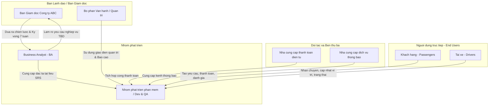

# Tài liệu Đặc tả Yêu cầu Hệ thống (SRS) - CAB System

## Bước 1: Đọc và phân tích sơ khởi yêu cầu của khách hàng

### 1. Hiểu ngữ cảnh nghiệp vụ
Công ty ABC kinh doanh dịch vụ đặt xe trực tuyến. Khách hàng đặt xe thông qua tổng đài hoặc ứng dụng, sau đó hệ thống tìm tài xế, thực hiện chuyến đi, tính cước, thanh toán và đánh giá.

Công ty muốn xây dựng CAB System trong 7 tuần để tự động hóa quy trình và hỗ trợ 3 nhóm người dùng chính:
*   Khách hàng: đặt và theo dõi chuyến xe, thanh toán, đánh giá.
*   Tài xế: nhận chuyến, cập nhật trạng thái và vị trí.
*   Nhân viên vận hành: quản lý khách hàng, tài xế, chuyến đi, giao dịch và báo cáo.

### 2. Khách hàng đang gặp vấn đề gì?
*   Việc **tìm kiếm và phân công tài xế còn thủ công**.
*   Khách hàng **khó theo dõi trạng thái chuyến đi** và thời gian tài xế đến.
*   **Thông tin thanh toán chưa được quản lý tập trung**.
*   Khi tài xế **từ chối hoặc không phản hồi**, việc tìm tài xế khác còn hạn chế.
*   Nhân viên vận hành **khó quản lý tài xế, khách hàng, chuyến đi và giao dịch**.
*   Khó xử lý các trường hợp **chuyến bị lỗi hoặc phát sinh sự cố**.
*   Khó thống kê **doanh thu, số lượng chuyến, tỷ lệ hoàn thành/hủy và hiệu quả tài xế**.
*   Hệ thống hiện tại **khó mở rộng** khi số lượng khách hàng và tài xế tăng.
*   Cần cải thiện **bảo mật, phân quyền và lưu vết thao tác**.

### 3. Tại sao cần lựa chọn hệ thống mới?
Công ty ABC cần xây dựng hệ thống mới để:
*   **Tự động hóa** việc tìm kiếm và phân công tài xế.
*   Giúp khách hàng **đặt xe và theo dõi chuyến đi dễ dàng**.
*   **Quản lý tập trung** chuyến đi và thanh toán.
*   Hỗ trợ nhân viên vận hành **quản lý và xử lý sự cố hiệu quả**.
*   Cung cấp **báo cáo và thống kê** phục vụ quản lý.
*   Nâng cao **tính bảo mật và phân quyền**.
*   Đảm bảo hệ thống **ổn định, dễ mở rộng và dễ bảo trì**.
*   Cho phép bổ sung **dịch vụ, phương thức thanh toán và kênh thông báo mới** trong tương lai.

### 4. Vấn đề nghiệp vụ tổng quát
> **Công ty ABC đang gặp khó khăn trong việc quản lý và vận hành dịch vụ đặt xe do quy trình phân công tài xế còn thủ công, khách hàng khó theo dõi chuyến đi, thanh toán chưa được quản lý tập trung và hệ thống khó mở rộng. Vì vậy, công ty cần xây dựng CAB System để tự động hóa quy trình đặt xe, nâng cao hiệu quả vận hành, cải thiện trải nghiệm khách hàng và tạo nền tảng có khả năng mở rộng trong tương lai.**

---

## Bước 2: Ma trận Stakeholder (Vai trò và Tầm ảnh hưởng)

| STT | Stakeholder                     | Vai trò                                                                      |
| --- | ------------------------------- | ---------------------------------------------------------------------------- |
| 1   | **Ban giám đốc**                | Đưa ra định hướng, phê duyệt dự án, theo dõi doanh thu và hiệu quả hoạt động |
| 2   | **Khách hàng**                  | Đặt xe, theo dõi chuyến đi, thanh toán và đánh giá tài xế                    |
| 3   | **Tài xế**                      | Nhận chuyến, thực hiện chuyến và cập nhật trạng thái, vị trí                 |
| 4   | **Nhân viên vận hành**          | Quản lý khách hàng, tài xế, phương tiện, chuyến đi và xử lý sự cố            |
| 5   | **Nhân viên quản trị hệ thống** | Quản lý tài khoản, phân quyền, bảo mật và cấu hình hệ thống                  |
| 6   | **Nhà cung cấp thanh toán**     | Cung cấp dịch vụ và xử lý thanh toán điện tử                                 |
| 7   | **Nhà cung cấp thông báo**      | Cung cấp các kênh gửi thông báo cho khách hàng và tài xế                     | 
| 8   | **Đội phát triển hệ thống**     | Thiết kế, xây dựng, kiểm thử và triển khai hệ thống                          |

Mã,Mục đích nhiệm vụ,Nội dung
BG01,Tự động hóa quy trình đặt xe,Cho phép khách hàng đặt xe trực tuyến và hệ thống tự động xử lý yêu cầu đặt xe.
BG02,Tự động tìm và phân công tài xế,"Tìm tài xế phù hợp dựa trên vị trí, trạng thái sẵn sàng và các tiêu chí vận hành."
BG03,Nâng cao khả năng theo dõi chuyến đi,Cho phép khách hàng và nhân viên vận hành theo dõi trạng thái chuyến và vị trí tài xế.
BG04,Quản lý tính cước và thanh toán,Tính chính xác số tiền phải trả và hỗ trợ thanh toán tiền mặt hoặc điện tử.
BG05,Quản lý thông báo,Cung cấp thông báo kịp thời cho khách hàng và tài xế trong quá trình đặt và thực hiện chuyến.
BG06,Nâng cao hiệu quả vận hành,"Hỗ trợ nhân viên quản lý khách hàng, tài xế, phương tiện, chuyến đi và xử lý sự cố."
BG07,Cung cấp báo cáo và thống kê,"Theo dõi số chuyến, doanh thu, tỷ lệ hoàn thành, tỷ lệ hủy và hiệu quả tài xế."
BG08,Đảm bảo an toàn và bảo mật dữ liệu,"Xác thực người dùng, phân quyền quản trị, bảo vệ dữ liệu cá nhân, vị trí và giao dịch."
BG09,Đảm bảo tính ổn định và khả năng mở rộng,Hệ thống hoạt động ổn định khi tải tăng và cho phép mở rộng từng thành phần độc lập.
BG10,Tạo nền tảng phát triển lâu dài,"Cho phép bổ sung dịch vụ, phương thức thanh toán, kênh thông báo và thay đổi thành phần kỹ thuật trong tương lai."
